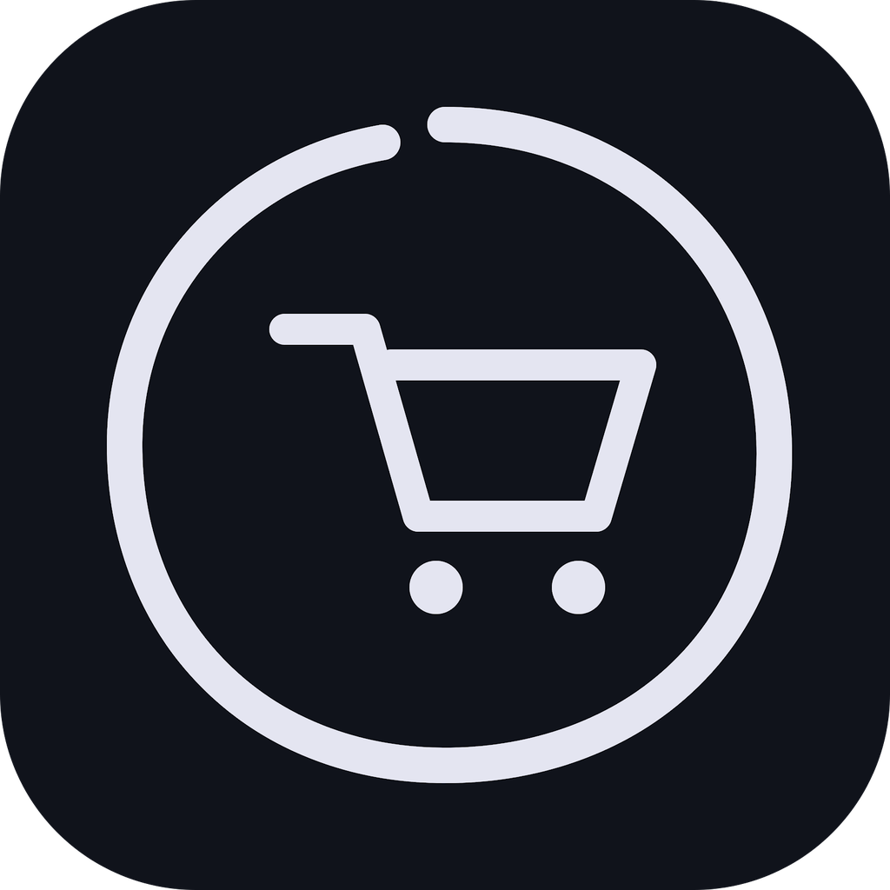
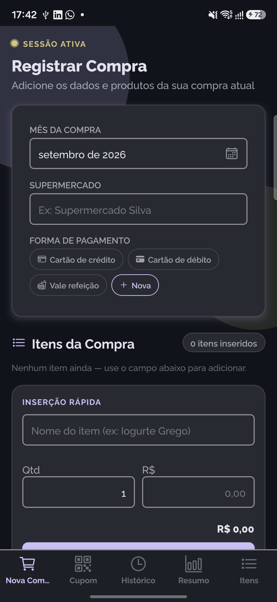
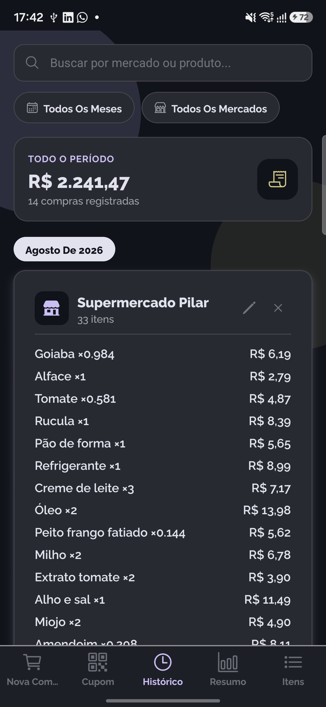
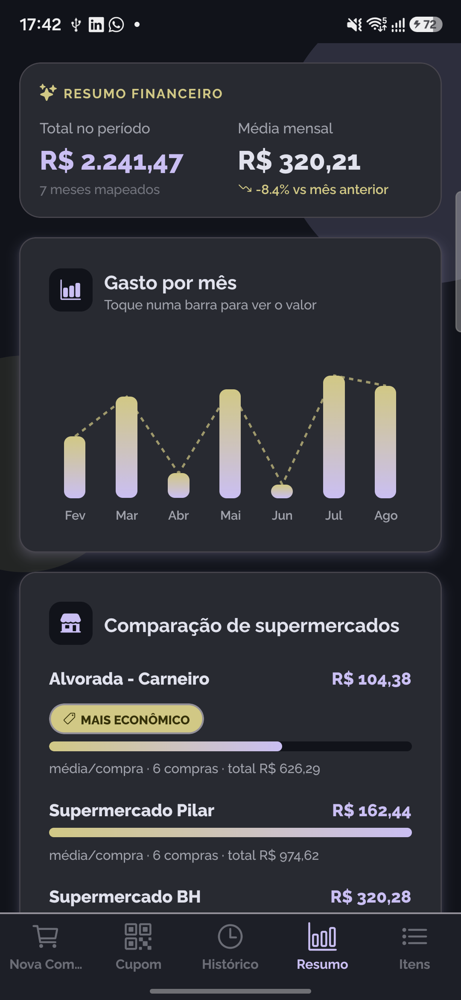
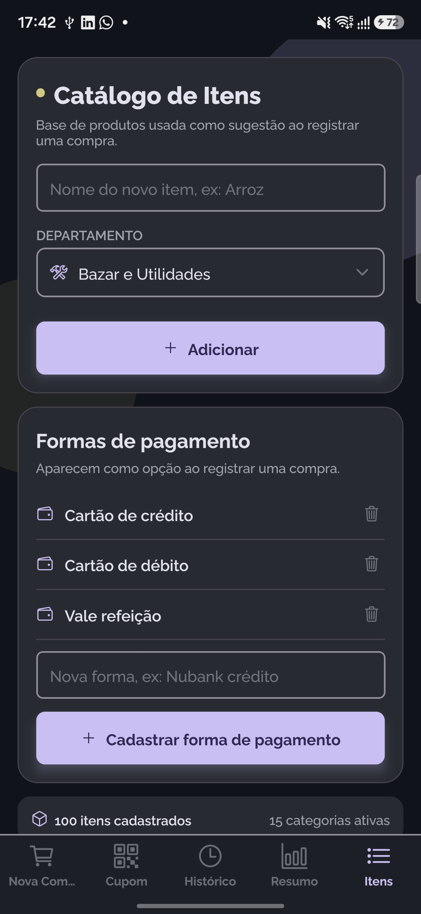

<div align="center">



# Vortex Cart

**Registre suas compras de mercado item por item e descubra em qual supermercado o seu dinheiro rende mais.**

Leia o QR Code do cupom fiscal e a compra se preenche sozinha.


</div>

---

## Telas

<div align="center">

|                                         Nova Compra                                         |                                          Histórico                                          |
| :-----------------------------------------------------------------------------------------: | :-----------------------------------------------------------------------------------------: |
|  |  |
|                          Mês, mercado, forma de pagamento e itens                           |                       Compras agrupadas por mês, com busca e filtros                        |

|                                        Resumo                                        |                                        Itens                                         |
| :----------------------------------------------------------------------------------: | :----------------------------------------------------------------------------------: |
|  |  |
|                     Gasto por mês e comparação de supermercados                      |                   Catálogo por departamento e formas de pagamento                    |

</div>

## O que ele faz

**Leitura do cupom fiscal por QR Code.** Aponte a câmera para o QR Code da nota (NFC-e,
Minas Gerais) e os itens entram na compra automaticamente, com nome, quantidade e valor. Itens
que já estão no seu catálogo são reconhecidos pelo nome cadastrado, em vez de criar
duplicatas.

**Registro manual, quando preferir.** Mês, supermercado, forma de pagamento e itens. Ao
digitar um item, o app sugere o que já existe no catálogo e preenche o valor com o preço
médio que você já pagou por ele.

**Histórico completo.** Compras agrupadas por mês, com busca por mercado ou produto,
filtros por período e por comércio, edição e exclusão.

**Comparação de supermercados.** Gasto por mês em gráfico, e o ranking dos mercados pelo
valor médio por compra, com selo para o mais econômico.

**Catálogo em 15 departamentos.** Padaria, Hortifruti, Frios e Laticínios, Carnes,
Limpeza e mais. Cada item guarda o preço médio, calculado do seu próprio histórico.

**Formas de pagamento cadastráveis.** Cartão de débito, crédito e vale refeição já vêm
prontos; você pode cadastrar outras.

**Backup em JSON, CSV ou PDF.** A importação de JSON soma aos dados existentes, sem
substituir nem apagar nada.

**Tema claro e escuro**, seguindo a preferência do sistema.

## Privacidade

Tudo é gravado em um banco SQLite no próprio aparelho. Não há conta, servidor nem
rastreador, e nenhum dado de compra sai do celular.

A **única** funcionalidade que usa internet é a leitura do cupom fiscal: ela abre o portal
da SEFAZ-MG para consultar a nota que você escaneou. O acesso é ao portal do governo, com
a chave impressa no seu próprio cupom.

## Tecnologias

| Camada       | Escolha                                    | Por quê                                             |
| ------------ | ------------------------------------------ | --------------------------------------------------- |
| Framework    | React Native + Expo (SDK 57)               | Managed workflow, sem configuração nativa manual    |
| Linguagem    | TypeScript strict                          | Segurança de tipos em todo o domínio                |
| Navegação    | Expo Router                                | Roteamento por arquivos, menos boilerplate          |
| Estado       | Zustand                                    | Suficiente para um app local, sem cache de servidor |
| Persistência | expo-sqlite                                | `SUM`/`AVG`/`GROUP BY` para os relatórios de gasto  |
| Formulários  | React Hook Form + Zod                      | Validação tipada                                    |
| Cupom fiscal | expo-camera + react-native-webview         | Leitura do QR Code e consulta ao portal             |
| Backup       | expo-file-system, expo-sharing, expo-print | JSON, CSV e PDF                                     |
| Qualidade    | ESLint, Prettier, Husky, Commitlint, Jest  | Consistência e testes automáticos                   |

O raciocínio por trás de cada escolha está em
[ARCHITECTURE.md](docs/projeto/ARCHITECTURE.md).

## Começando

```bash
git clone https://github.com/Emanuel-Mendonca/vortexcart.git
cd vortexcart
npm install
```

```bash
npx expo start
```

Escaneie o QR code com o **Expo Go** (compatível com SDK 57). Para gerar um APK instalável
sem depender do Expo Go, veja o [GUIA.md](docs/projeto/GUIA.md).

## Estrutura

```
app/          rotas (Expo Router), cada arquivo só renderiza uma tela

src/
  ui/         componentes, telas, tema e assets
  data/       SQLite, store (Zustand) e tipos de domínio
  services/   leitura de cupom fiscal e backup, o I/O externo
  shared/     funções puras e constantes, sem dependência de UI nem de banco

docs/
  projeto/    documentação técnica
  index.html  landing page publicada no GitHub Pages
```

A dependência só desce: `ui` conhece `data`, `data` conhece `shared`, e `shared` não conhece
ninguém. É por isso que quase toda a cobertura de testes vive em `shared/`.

## Documentação

| Documento                                       | Conteúdo                                    |
| ----------------------------------------------- | ------------------------------------------- |
| [ARCHITECTURE.md](docs/projeto/ARCHITECTURE.md) | Camadas, fluxo de dados e decisões técnicas |
| [ROADMAP.md](docs/projeto/ROADMAP.md)           | O que já foi entregue e o que vem a seguir  |
| [BRANDING.md](docs/projeto/BRANDING.md)         | Nome, símbolo, paleta e variações do logo   |
| [GUIA.md](docs/projeto/GUIA.md)                 | Rodar, gerar APK e publicar                 |
| [CONTRIBUTING.md](.github/CONTRIBUTING.md)      | Fluxo, convenções de código e testes        |
| [CHANGELOG.md](CHANGELOG.md)                    | Histórico de mudanças                       |

## Contribuindo

Contribuições são bem-vindas. Leia o [CONTRIBUTING.md](.github/CONTRIBUTING.md) e o
[CODE_OF_CONDUCT.md](.github/CODE_OF_CONDUCT.md) antes de começar.

Para reportar uma vulnerabilidade, siga o [SECURITY.md](.github/SECURITY.md), não abra
issue pública.

## Licença

MIT, veja [LICENSE](LICENSE).
